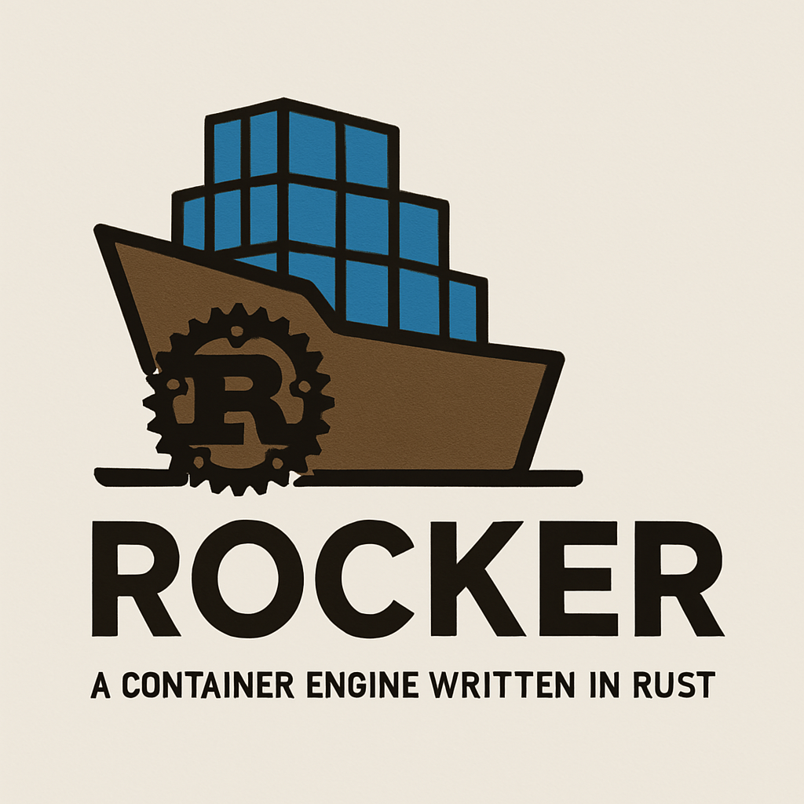

# Rocker: A Container Engine written in Rust

<p align="center">
  
</p>

Rocker is a Docker-like container management system implemented in Rust, providing container capabilities with a focus on performance, safety, and usability. As a memory-safe alternative to traditional container engines, Rocker aims to provide enterprise-grade container orchestration with enhanced security guarantees.

[](https://opensource.org/licenses/MIT)

## Table of Contents

- [Project Structure](#project-structure)
- [Features](#features)
- [Requirements](#requirements)
- [Installation](#installation)
  - [Building from Source](#building-from-source)
  - [Prebuilt Binaries](#prebuilt-binaries)
- [Usage](#usage)
  - [Daemon Management](#daemon-management)
  - [Container Management](#container-management)
  - [Image Management](#image-management)
  - [Network Management](#network-management)
  - [Volume Management](#volume-management)
  - [Using Rockerfiles](#using-rockerfiles)
  - [Using Rocker Compose](#using-rocker-compose)
- [Configuration](#configuration)
- [Troubleshooting](#troubleshooting)
- [Security](#security)
- [Benchmarks](#benchmarks)
- [License](#license)
- [Contributing](#contributing)

## Project Structure

Rocker consists of several modular components:

- **rocker-cli**: Command-line interface for interacting with the Rocker daemon
- **rocker-daemon**: Background service that manages containers, images, networks, and volumes
- **rocker-core**: Shared library with common functionality and data structures
- **rockerfile-parser**: Parser and processor for Rockerfiles (similar to Dockerfiles)
- **rocker-compose**: Tool for defining and running multi-container applications

## Features

- **Container Lifecycle Management**
  - Create, run, pause, resume, stop, and remove containers
  - Resource constraints (CPU, memory, IO)
  - Health checks and auto-restart policies
  
- **Image Management**
  - Build custom images using Rockerfiles
  - Pull and push images from/to registries
  - Layer caching for optimized builds
  - Multi-stage builds for smaller images
  
- **Network Management**
  - Bridge, host, and overlay networking
  - Custom network creation
  - Port mapping and exposure
  - Container DNS resolution
  
- **Volume Management**
  - Named volumes
  - Bind mounts
  - tmpfs mounts
  
- **Rockerfile** - Docker-compatible image definition format
  - Support for most Dockerfile instructions
  - Multi-stage builds
  - Build arguments and environment variables
  
- **Rocker Compose**
  - Define and orchestrate multi-container applications
  - Service dependencies and scaling
  - Network and volume integration
  - Environment configuration

## Requirements

- Rust (stable channel, 1.65.0 or newer)
- Linux kernel with support for:
  - Namespaces (pid, net, mnt, uts, ipc, user)
  - Cgroups v2
  - Overlay filesystem
- Additional dependencies:
  - libseccomp-dev (for syscall filtering)
  - libudev-dev (for device management)

## Installation

### Building from Source

1. Clone the repository:
   ```bash
   git clone https://github.com/engineers-hub-ltd-in-house-project/rocker.git
   cd rocker
   ```

2. Build all components:
   ```bash
   cargo build --release
   ```

3. Install the binaries (optional):
   ```bash
   sudo cp target/release/rocker /usr/local/bin/
   sudo cp target/release/rockerd /usr/local/bin/
   ```

4. Setup initial directories:
   ```bash
   sudo mkdir -p /var/lib/rocker/{containers,images,volumes,networks}
   sudo mkdir -p /var/run/rocker
   ```

### Prebuilt Binaries

Download the latest release from our [GitHub Releases page](https://github.com/engineers-hub-ltd-in-house-project/rocker/releases).

## Usage

### Daemon Management

Start the Rocker daemon:

```bash
# Start in foreground
rockerd --debug

# Start in background
rockerd --daemon
```

Stop the daemon:

```bash
rocker system stop
```

View daemon information:

```bash
rocker info
```

### Container Management

Run a container:

```bash
# Basic usage
rocker run nginx:alpine

# Detached mode with name
rocker run -d --name web-server nginx:alpine

# With port mapping
rocker run -d -p 8080:80 nginx:alpine

# With environment variables
rocker run -d -e DB_HOST=localhost -e DB_PORT=5432 postgres:14

# With volume mounting
rocker run -d -v /host/path:/container/path redis:alpine

# With resource limits
rocker run -d --cpus 0.5 --memory 512m mysql:8
```

List containers:

```bash
# List running containers
rocker ps

# List all containers
rocker ps -a
```

Container operations:

```bash
# Stop a container
rocker stop <container-id-or-name>

# Start a stopped container
rocker start <container-id-or-name>

# Pause a container
rocker pause <container-id-or-name>

# Resume a paused container
rocker unpause <container-id-or-name>

# Remove a container
rocker rm <container-id-or-name>

# Force remove a running container
rocker rm -f <container-id-or-name>
```

View container logs:

```bash
# Show logs
rocker logs <container-id-or-name>

# Follow logs
rocker logs -f <container-id-or-name>
```

Execute commands in a running container:

```bash
rocker exec <container-id-or-name> <command>

# Interactive shell
rocker exec -it <container-id-or-name> /bin/bash
```

### Image Management

List images:

```bash
rocker images
```

Pull an image:

```bash
rocker pull ubuntu:22.04
```

Build an image:

```bash
# Build from current directory
rocker build -t my-image:latest .

# Specify Rockerfile path
rocker build -t my-image:latest -f ./path/to/Rockerfile .

# With build arguments
rocker build -t my-image:latest --build-arg VERSION=1.0 .
```

Remove an image:

```bash
rocker rmi <image-id-or-name>
```

Push an image to a registry:

```bash
# Login to registry
rocker login <registry-url>

# Push image
rocker push my-image:latest
```

### Network Management

List networks:

```bash
rocker network ls
```

Create a network:

```bash
rocker network create --driver bridge my-network
```

Connect a container to a network:

```bash
rocker network connect my-network <container-id-or-name>
```

Disconnect a container from a network:

```bash
rocker network disconnect my-network <container-id-or-name>
```

Remove a network:

```bash
rocker network rm my-network
```

### Volume Management

List volumes:

```bash
rocker volume ls
```

Create a volume:

```bash
rocker volume create my-volume
```

Remove a volume:

```bash
rocker volume rm my-volume
```

### Using Rockerfiles

A Rockerfile is similar to a Dockerfile, with some enhancements. Here's an example:

```dockerfile
FROM ubuntu:22.04

# Set environment variables
ENV APP_HOME=/app \
    NODE_ENV=production

# Set working directory
WORKDIR $APP_HOME

# Install dependencies
RUN apt-get update && \
    apt-get install -y nodejs npm && \
    apt-get clean && \
    rm -rf /var/lib/apt/lists/*

# Copy application files
COPY . .

# Install application dependencies
RUN npm install

# Expose port
EXPOSE 3000

# Define entrypoint
CMD ["npm", "start"]
```

### Using Rocker Compose

Create a `rocker-compose.yaml` file:

```yaml
version: '1'
services:
  web:
    build: ./web
    ports:
      - "8080:80"
    depends_on:
      - db
    environment:
      DB_HOST: db
      DB_PORT: 5432
      
  db:
    image: postgres:14
    volumes:
      - db-data:/var/lib/postgresql/data
    environment:
      POSTGRES_PASSWORD: example
      POSTGRES_DB: app

networks:
  default:
    driver: bridge

volumes:
  db-data:
    driver: local
```

Run your multi-container application:

```bash
# Start services
rocker compose up -d

# View running services
rocker compose ps

# View logs
rocker compose logs

# Stop services
rocker compose down

# Stop services and remove volumes
rocker compose down -v
```

## Configuration

Rocker configuration is stored in `/etc/rocker/config.toml`:

```toml
[daemon]
debug = false
log_level = "info"
socket = "/var/run/rocker/rocker.sock"
data_root = "/var/lib/rocker"

[registry]
mirrors = ["https://registry-1.docker.io"]
insecure_registries = []

[network]
default_bridge_subnet = "172.17.0.0/16"
default_bridge_gateway = "172.17.0.1"
```

## Troubleshooting

### Common Issues

**Problem**: `Cannot connect to the Rocker daemon`
- Ensure the daemon is running: `ps aux | grep rockerd`
- Check socket permissions: `ls -la /var/run/rocker.sock`
- Restart the daemon: `sudo systemctl restart rockerd`

**Problem**: `Permission denied when running containers`
- Ensure your user is in the 'rocker' group: `sudo usermod -aG rocker $USER`
- Verify directory permissions: `ls -la /var/lib/rocker`

**Problem**: `Network connectivity issues between containers`
- Check network configuration: `rocker network inspect <network-name>`
- Verify iptables rules: `sudo iptables -L -n`

### Logs

View daemon logs:

```bash
# If running as a systemd service
journalctl -u rockerd.service

# If configured to log to a file
cat /var/log/rocker/daemon.log
```

Enable debug logging:

```bash
rockerd --log-level debug
```

## Security

Rocker is designed with security in mind:

- Built in Rust to eliminate memory safety issues
- Container isolation using Linux namespaces and cgroups
- Seccomp profiles to limit available syscalls
- User namespace mapping for privileged operations
- Regular security audits and updates

## Benchmarks

Performance comparison with other container engines:

| Operation | Rocker | Docker | Podman |
|-----------|--------|--------|--------|
| Container start time | 0.8s | 1.2s | 1.0s |
| Image build (node:alpine) | 12s | 15s | 14s |
| Memory usage (daemon) | 15MB | 50MB | 35MB |

## License

This project is licensed under the MIT License - see the [LICENSE](LICENSE) file for details.

## Contributing

Contributions are welcome! Please feel free to submit a Pull Request.

1. Fork the repository
2. Create your feature branch: `git checkout -b feature/amazing-feature`
3. Commit your changes: `git commit -m 'Add some amazing feature'`
4. Push to the branch: `git push origin feature/amazing-feature`
5. Open a Pull Request

Before contributing, please read our [Code of Conduct](CODE_OF_CONDUCT.md). 
